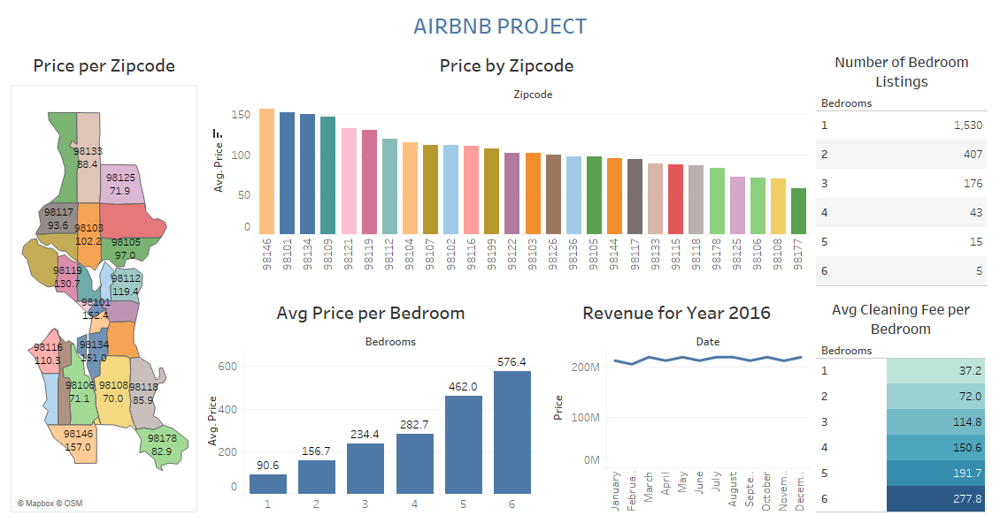

<h1 align="center">Airbnb Project Using Tableau</h1>
<h4 align="center">24th October, 2022</h4> 

<h3>Business Task</h3> 

Airbnb is an online marketplace based in San Francisco, U.S that connects people who wants to rent out their homes with people who are looking for accommodations in specific locations.

A potential client wants to list his property with Airbnb and therefore wants the best deals. He wants:

<ol>
  <li>The best location that guarantees patronage and profits;</li>
  <li>An insight into the best months in terms of revenue;</li>
  <li>To have an idea of the average price for rents based on the numbers of rooms in an accommodation;</li>
  <li>To have an idea about the cleaning costs;</li>
  <li>Confirm the type of accommodation that is in high demand;</li>
  <li>To have an idea into the various types of accommodations already listed.</li>
</ol>

<h3>Data Sources</h3> 

There are three tables:

<ol>
  <li>Calendar;</li> 
  <li>Listings;</li>
  <li>Reviews.</li>
</ol>

The Airbnb dataset can be found <a href="https://docs.google.com/spreadsheets/d/1vNgmbtp5oUUfSMPuRnOA1iAr4mB4vBrN/edit?usp=sharing&ouid=116861498863177309837&rtpof=true&sd=true">here</a>:
 
 
<h3>Data Visualization Tool</h3>

Tableau was the  business intelligence software used.
 

<h3>Data Visualization Process</h3>

The following steps were taken in Tableau:
 
<ol>
   <li>Inner joins are performed on the Calendar, listings and Reviews tables;</li>
   <li>Visualizations are created to answer the potential client’s questions;</li>
   <li>The “Price by Zipcode” bar chart in the dashboard is used as a filter.</li>
</ol>

<h3>Dashboard</h3>

   

Click <a href="https://public.tableau.com/views/DashboardProjectonCovid-19Dataset/Covid-19Dashboard?:language=en-US&:display_count=n&:origin=viz_share_link">here</a> to view on Tableau Public.

<h3>Recommendations and Conclusion</h3>
<ol>
  <li>Zipcode 98146 has the highest average price for accommodations and as such should be considered as the best destination for best returns on investment.</li>
  <li>Business is great for people with properties all round the clock of the year as seen on the “Revenue for Year” 2016 chart.</li>
  <li>Accommodation with one room goes for the lowest price.</li>
  <li>Cleaning costs is the lowest for accommodation with one bedroom.</li>
  <li>Accommodation with one bedroom is best to start with on a low budget.</li>
</ol>

